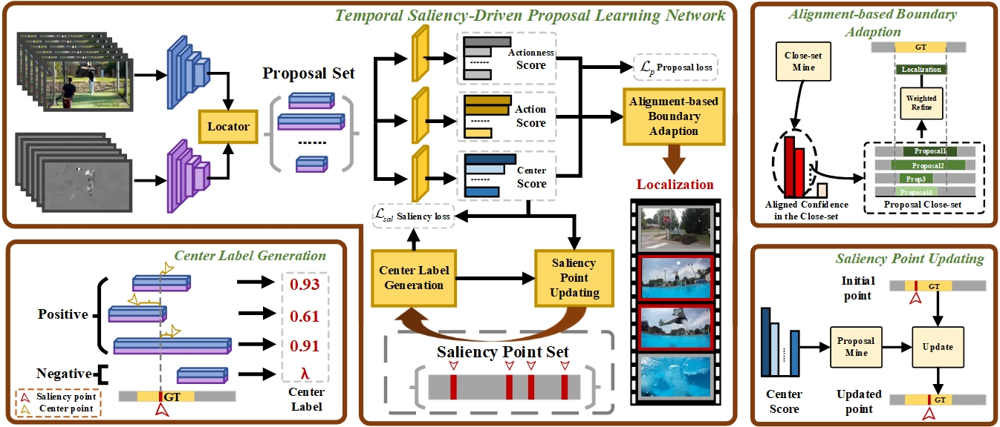

# (CVPR2024) Realigning Confidence with Temporal Saliency Information for Point-level Weakly-Supervised Temporal Action Localization

## Introduction

This is an official release of our paper **"Realigning Confidence with Temporal Saliency Information for Point-level Weakly-Supervised Temporal Action Localization"**. [[Paper]](https://drive.google.com/file/d/1wE89FsNCMb7UwZ3VN16n0M_QHVnZgo-f/view?usp=drive_link) 

Ziying Xia, Jian Cheng, Siyu Liu, Yongxiang Hu, Shiguang Wang, Yijie Zhang, Wanli Dang



> Point-level weakly-supervised temporal action localization  (P-TAL) aims to localize action instances in untrimmed videos through the use of single-point annotations in each instance. Existing methods predict the class activation sequences without any boundary information, and the unreliable sequences result in a significant misalignment between the quality of proposals and their corresponding confidence. In this paper, we surprisingly observe the most salient frame tend to appear in the central region of the each instance and is easily annotated by humans. Guided by the temporal saliency information, we present a novel proposal-level plug-in framework to relearn the aligned confidence of proposals generated by the base locators. The proposed approach consists of Center Score Learning (CSL) and Alignment-based Boundary Adaptation (ABA). In CSL, we design a novel center label generated by the point annotations for predicting aligned center scores. During inference, we first fuse the center scores with the predicted action probabilities to obtain the aligned confidence. ABA utilizes the both aligned confidence and IoU information to enhance localization completeness. Extensive experiments demonstrate the generalization and effectiveness of the proposed framework, showcasing state-of-the-art or competitive performances across three benchmarks.

## Requirements

Here are the necessary dependencies:

- CUDA: 11.3
- Python: 3.8.16
- Pytorch: 1.10.0
- Numpy: 1.20.3
- Pandas: 1.5.3
- Tqdm: 4.65.0

## Data Preparation

### 1. Feature Extraction

We use the extracted THUMOS14 features provided by [LAC](https://github.com/Pilhyeon/Learning-Action-Completeness-from-Points), or you can obtain the feature from [GoogleDrive](https://drive.google.com/file/d/1OhHXnGR3nmZf_W9dWlB1d9gIqkMpoAoX/view?usp=drive_link).

After getting the features, move the folder  `features` into `./data/THUMOS14/`.

### 2. Proposal Generation

The action proposal can be obtained by reproducing the P-TAL methods without any post-processing operations.

We have provided the proposals generated by [LAC](https://github.com/Pilhyeon/Learning-Action-Completeness-from-Points) in `./data/THUMOS14`.

## Usage

### Training

Run:

```
bash ./train_thumos.sh 
```

### Testing

Download the pre-trained model from  [GoogleDrive](https://drive.google.com/file/d/1wE89FsNCMb7UwZ3VN16n0M_QHVnZgo-f/view?usp=drive_link).  Change the model path in  `./test_thumos.sh`, and run:

```
bash ./test_thumos.sh 
```

## Citation

```
@InProceedings{Xia_2024_CVPR,
    author    = {Xia, Ziying and Cheng, Jian and Liu, Siyu and Hu, Yongxiang and Wang, Shiguang and Zhang, Yijie and Dang, Liwan},
    title     = {Realigning Confidence with Temporal Saliency Information for Point-Level Weakly-Supervised Temporal Action Localization},
    booktitle = {Proceedings of the IEEE/CVF Conference on Computer Vision and Pattern Recognition (CVPR)},
    month     = {June},
    year      = {2024},
    pages     = {18440-18450}
}
```

## Contact

If you have any question please contact zyxia@std.uestc.edu.cn

## Acknowledgment

This code contains modified codes from [LAC](https://github.com/Pilhyeon/Learning-Action-Completeness-from-Points) and [P-MIL](https://github.com/RenHuan1999/CVPR2023_P-MIL).

Thanks for their excellent works and great contributions for the community!

